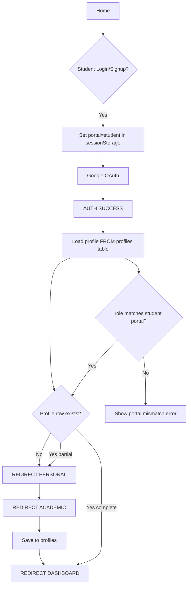
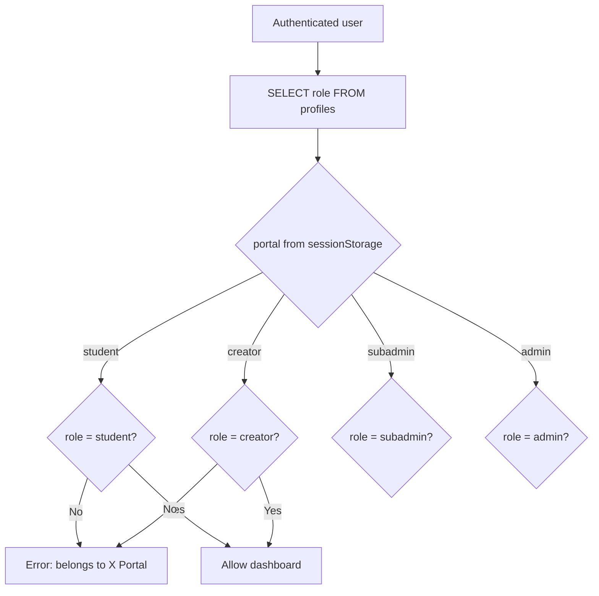

# Critical System Fix — Audit Report

## Issue 1: Google Auth Returns to Home

### Root cause
1. `startBrowserNavigation()` forces `#/landing` when `APP.session` is false, before async Supabase restore completes (`installBrowserNavigation.js`).
2. `syncSessionFromSupabase()` and `restoreSupabaseSession()` skip routing when hash is landing (`isAtLanding` guard).
3. OAuth callback hash is often `#access_token=...`, not `#/auth`, so route + session restore never align.
4. No single post-auth coordinator; four competing listeners with different guards.

### Files affected
- `src/legacy/installBrowserNavigation.js`
- `src/legacy/legacy-app.js` (`syncSessionFromSupabase`, `window.load`)
- `src/legacy/aimeasy-fixes.js` (`restoreSupabaseSession`)
- `src/services/auth/postAuthRouter.js` (new)

---

## Issue 2: Role Mixing

### Root cause
1. Roles from `APP.role`, `aimeasy_active_role`, `aimeasy_oauth_role`, and `localStorage` — not `profiles` table.
2. `profileFromSupabaseUser()` maps UI teacher selection to `creator` role in localStorage.
3. `patchTeacherToCreator` sends teacher Google mocks to creator dashboard without DB check.
4. Stale `edusync_user_*` localStorage overrides fresh Supabase user.

### Files affected
- `src/legacy/aimeasy-fixes.js`
- `src/legacy/legacy-patches.js`
- `src/services/auth/profileService.js` (new)

---

## Issue 3: Sub Admin Content Not Persisting

### Root cause
1. Writes go to `localStorage` (`edusync_admin_*`) only; Supabase mirror is `app_state` blobs, not relational CRUD.
2. Branch filter hides created subjects from list.
3. Roadmap topics require explicit Save; Add Topic is DOM-only until save.
4. Success toasts fire before DB write confirmation.

### Files affected
- `src/legacy/legacy-app.js` (v10* functions)
- `src/services/content/contentRepository.js` (new)
- `supabase/schema.sql`

---

## Issue 4: Video Background Play

### Root cause
No iframe teardown in `navigateTo`, `backToUnits`, `switchTab`, `openSubject`, `openUnit`.

### Files affected
- `src/legacy/legacy-app.js`
- `src/services/media/stopVideoPlayer.js` (new)

---

## Issue 5: Search Not Working

### Root cause
`handleSearch()` only searches static `SUBJECTS_DB`, shows toast, no navigation.

### Files affected
- `src/legacy/legacy-app.js`
- `src/services/search/studentSearch.js` (new)

---

## Issue 6: Back Button Logout

### Root cause
`aimeasySafeBack('/landing')` at history index 0; `subAdminBack()` clears `edusync_session_user`.

### Files affected
- `src/legacy/installBackButtonFixes.js`
- `src/legacy/legacy-app.js` (`subAdminBack`)

---

## Issue 7: Google Auth Only for Students

### Root cause
Teacher/creator flows still expose Google mock accounts; patches route teacher keys to creator.

### Files affected
- `src/legacy/legacy-patches.js`
- `src/legacy/legacy-app.js` (`proceedWithRole`, `googleSignIn`)

---

## Issue 8: Dashboard Mock Counts

### Root cause
`renderAdminSection('dashboard')` hardcodes numbers; `statsLiveFromSupabase` queries missing `users` table.

### Files affected
- `src/legacy/aimeasy-fixes.js`
- `src/services/admin/adminStatsService.js` (new)

---

## Issue 9: Academic Dropdowns

### Root cause
`profile.html` hardcoded options; only regulations partially loaded from Supabase; no `universities`/`branches` tables.

### Files affected
- `supabase/schema.sql`
- `src/pages/profile/profile.html`
- `src/services/academic/academicCatalog.js` (new)

---

## Database queries (source of truth)

```sql
-- Profile by auth user
SELECT * FROM profiles WHERE id = $id;

-- Role validation
SELECT role FROM profiles WHERE id = $id;

-- Academic catalog
SELECT id, name FROM universities WHERE status = 'active' ORDER BY name;
SELECT id, regulation_name, regulation_code, university_id FROM regulations WHERE status = 'active';
SELECT id, name, university_id FROM branches WHERE status = 'active';

-- Admin stats
SELECT COUNT(*) FROM profiles WHERE role = 'student';
SELECT COUNT(*) FROM subjects;
SELECT COUNT(*) FROM branches;
SELECT COUNT(*) FROM universities;
SELECT COUNT(*) FROM profiles WHERE role = 'subadmin';
SELECT COUNT(*) FROM profiles WHERE role = 'creator';

-- Content CRUD
SELECT * FROM content_items WHERE subject_id = $id AND unit_id = $unit AND content_type = $type;
INSERT INTO content_items (...) VALUES (...);
UPDATE content_items SET ... WHERE id = $id;
DELETE FROM content_items WHERE id = $id;
```

---

## Authentication flow (target)



---

## Role validation (target)


